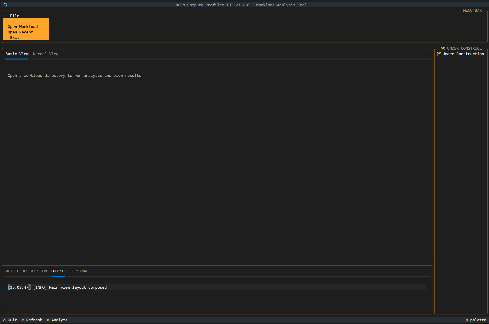

.. meta::
   :description: ROCm Compute Profiler analysis: Text-based User Interface
   :keywords: Omniperf, ROCm, profiler, tool, Instinct, accelerator, GUI, standalone, filter

****************************************
Text-based User Interface (TUI) analysis
****************************************

ROCm Compute Profiler's analyze mode now supports a lightweight Text-based User Interface (TUI)
that provides an interactive terminal experience for enhanced usability. You can use the TUI interface as
an alternative to the standard CLI if you want to explore analysis results with improved visual
It provides enhanced visual feedback and easy navigation without needing the extra setup of a full graphical interface.
This analysis option is implemented as a terminal-based interface
that offers real-time visual feedback, keyboard shortcuts for common actions, and improved
readability with formatted output.

.. note::

   TUI is currently in beta, so while functional, you may encounter minor issues or limitations.

Launch the TUI analyzer
----------------------------------

To launch the ROCm Compute Profiler TUI analyzer, use the ``--tui`` flag with the analysis command.
For example:

.. code-block:: shell-session

   $ rocprof-compute analyze --tui

To start the analysis, use the dropdown menu at the top left of the screen to select a single
workload from ``rocprof-compute profile`` generated output directories.

You should see the center window update with collapsed contents, uncollapse to view tables, charts,
and graphs visualizing the analysis data.

Once the analysis results are loaded, you can start interactive analysis with detailed metrics.
The TUI supports basic keyboard shortcuts, including quit application commands for easy navigation.
